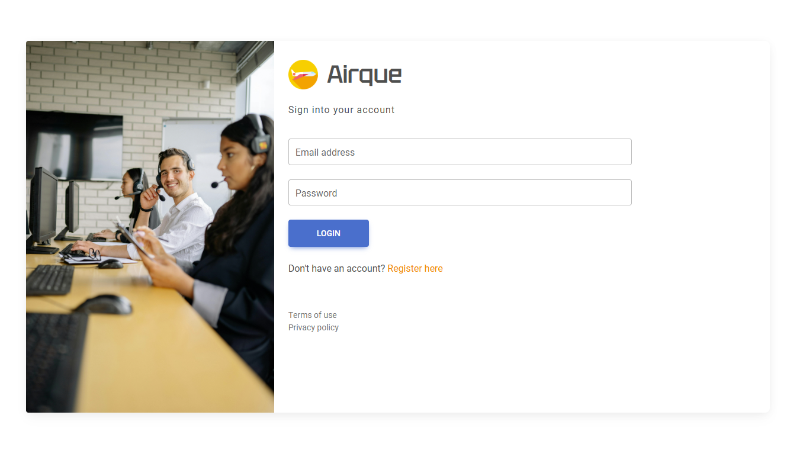

# Customer React App

## Project Description

Airque is a customer service platform that efficiently manages customer tickets. These tickets are raised by users to address concerns related to their experiences with the airline's services.

The platform consists of a ticket managing system built with React for the frontend and Express for the backend using an API. It allows registered users to create, view, update and delete support tickets while also send reviews as responses based on support agent feedbacks. Administrators or support agents have additional privileges to manage tickets and users.

## Getting Started

You can access the deployed application and the project's Trello board using the links below:

-   **Link to Deployed application :** [Customer Ticketing Application](https://customer-react-app.vercel.app/signin)
-   **Link to Planning material used:** [Trello Board](https://trello.com/b/N4oIyEP2/project-4-crud-ticket-managing-system)

## Attributions

-   MDB React UI Kit
-   Project design inspiration [www.phpscriptdemos.com](https://www.phpscriptdemos.com/support-desk/admin/index.php)
-   pexel images [Royalty free images](https://www.pexels.com/)
-   unsplash images [Royalty free images](https://unsplash.com/)

## Technologies Used

This project utilizes a variety of modern web technologies:

*   **Frontend:**
    *   React
    *   Vite
    *   Tailwind CSS
    *   React Router
    *   Chart.js (for data visualization)
*   **Backend:**
    *   Node.js
    *   Express
    *   MongoDB (with Mongoose)
    *   JWT (for authentication)
*   **Deployment:**
    *   Vercel (for frontend)
    *   Heroku (for backend deployment platform)

## Next Steps

Future enhancements planned for this application include:

*   Developing a live chat feature where customers and users can interact with each other in real-time.
*   Adding email notifications for ticket assignments and updates.
*   Add more control over profile, and user related data for user experience.
*   Adding external API's for company related data.
